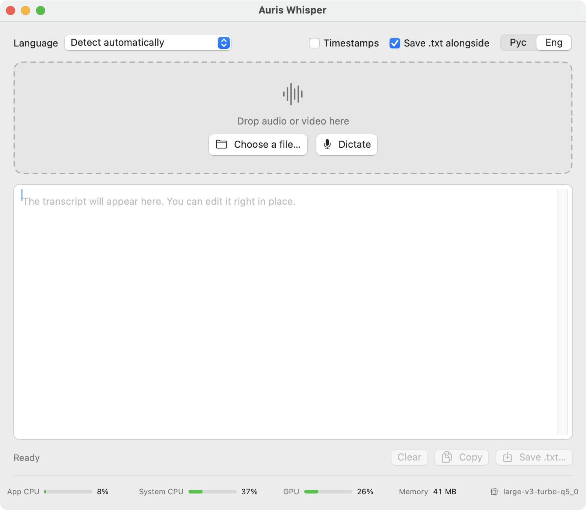

<div align="center">


# Auris Whisper

**Offline speech-to-text for macOS. Drop a file or dictate — get clean `.txt`.**
No internet, no accounts, no uploads. Everything runs on your Mac's own chip.

[](#download)
[](#compatibility)
[](LICENSE)
[](https://boopi.ru)



</div>

---

## What it does

- **Drop in audio or video** — mp3, m4a, wav, aiff, caf, aac, flac, mp4, mov and
  **ogg / oga / opus**. Drop several at once, they run one after another.
- **Ogg and Opus work.** macOS cannot open them with any system API, so
  libopusfile and libvorbisfile are compiled in. The container is detected by
  file signature, not by extension — renamed voice messages from messengers
  still open.
- **Dictate** (⌘R) with a live level meter, then *Stop and transcribe*.
  The recording is kept as `.wav` next to its transcript.
- **Ten recognition languages** or automatic detection.
- **Interface in English or Russian**, switched in the top-right corner.
- **Timestamps** on demand: `[00:12 → 00:19] the sentence`.
- **Auto-save**: `recording.mp3` produces `recording.txt` right beside it.
  Dictations land in `Documents/Whisper`.
- **Editable output** — fix the text in the window before saving.
- **Load meter** at the bottom: app CPU, system CPU, GPU utilisation, memory and
  the bundled model's name, refreshed every second.

Nothing is a wrapper around a web service. The model file lives inside the app
bundle and the inference runs on Metal, on your GPU.

## Download

Grab a `.zip` from [Releases](../../releases), unpack, drag the app anywhere.
It is fully self-contained — one arm64 binary plus the model, no external
libraries, no installer, no runtime downloads.

| Build | For |
|---|---|
| `AurisWhisper-x.y.z-macOS13+.zip` | macOS 13 Ventura and newer |
| `AurisWhisper-x.y.z-macOS12+.zip` | macOS 12 Monterey (also runs on newer) |

Both ship the `large-v3-turbo-q5_0` model (547 MB). GitHub caps release assets
at 2 GB, so the full 2.9 GB `large-v3` build is not distributed — build it
yourself in one command, see [below](#build-from-source).

### First launch

The app is signed ad-hoc, without an Apple Developer certificate. macOS will
say it cannot verify the developer — **right-click the app → Open → Open**,
once. Dictation asks for microphone access on first use.

## Compatibility

Runs on **every Apple Silicon Mac** — M1, M2, M3, M4 and their Pro/Max/Ultra
variants. Intel Macs are not supported: the binary is arm64 only.

One build detail worth knowing if you compile it yourself: ggml defaults to
`-mcpu=native`, which on an M4 emits SME and i8mm instructions that M1–M3 do
not have — such a binary dies with *Illegal instruction* on other Macs. This
project pins a portable baseline instead:

```
-DGGML_NATIVE=OFF -DGGML_CPU_ARM_ARCH="armv8.2-a+dotprod+fp16"
```

It costs nothing in speed — the heavy math runs on Metal, not on those
instructions.

## Models

Measured on an M4, 39 seconds of Russian speech, transcribing to punctuated text:

| Model | Size | Speed | Load time |
|---|---|---|---|
| `large-v3-turbo-q5_0` *(shipped)* | 547 MB | ×12.4 real time | ~1 s |
| `large-v3` | 2.9 GB | ×4.5 real time | ~5 s |

×12.4 means an hour of audio in about five minutes. On our test both models
produced the same text; turbo is simply lighter and faster. Any
[whisper.cpp model](https://huggingface.co/ggerganov/whisper.cpp) works — the
app picks up whatever single `.bin` sits in its `Resources` and shows its name
in the load meter.

## Build from source

Requirements: Xcode (or Command Line Tools), `cmake`, `git`.

```bash
git clone https://github.com/sibawal/auris-whisper.git
cd auris-whisper
./setup.sh          # fetches whisper.cpp + Ogg/Opus/Vorbis, builds them, downloads the model
./build.sh          # produces "Auris Whisper.app"
```

`setup.sh` pins exact upstream commits, so a build today matches a build a year
from now. Knobs:

```bash
MODEL_NAME=ggml-large-v3 ./setup.sh                  # a different model
MIN_MACOS=12.0 ./build.sh                            # lower deployment target
MODEL="$PWD/models/ggml-large-v3.bin" ./build.sh      # bundle that model
APP_PATH="out/Auris Whisper.app" ./build.sh          # build somewhere else
```

There is no Xcode project — `build.sh` calls `swiftc` directly and assembles the
bundle, which keeps the whole thing readable and scriptable.

A console harness for the same decoding and recognition code:

```bash
./build_test.sh
./test/whispertest models/ggml-large-v3-turbo-q5_0.bin recording.m4a ru
```

## How it is put together

| Piece | What it does |
|---|---|
| `src/AudioDecoder.swift` | any container → 16 kHz mono float via AVAssetReader, with an AVAudioFile fallback |
| `src/OggDecoder.swift` | Ogg Vorbis and Ogg Opus through libvorbisfile / libopusfile, plus a streaming resampler |
| `src/WhisperEngine.swift` | thin wrapper over the whisper.cpp C API; the model context stays loaded between runs |
| `src/Recorder.swift` | AVAudioEngine tap converted straight to 16 kHz mono |
| `src/SystemMonitor.swift` | CPU from mach `task_info`/`host_statistics`, GPU from IORegistry |
| `src/Localization.swift` | two-language UI without `.lproj` bundles |
| `build.sh` | compile, bundle, ad-hoc sign |

## License

MIT — see [LICENSE](LICENSE). Use it, change it, ship it.

Built on [whisper.cpp](https://github.com/ggml-org/whisper.cpp) and ggml (MIT),
the [Whisper](https://github.com/openai/whisper) model by OpenAI (MIT), and
libogg / libvorbis / libopus / libopusfile by Xiph.Org (BSD). Full notices in
[THIRD-PARTY-LICENSES.txt](THIRD-PARTY-LICENSES.txt).

<div align="center">

Made by [boopi.ru](https://boopi.ru) · [Русская версия README](README.ru.md)

</div>
