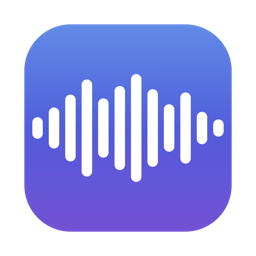
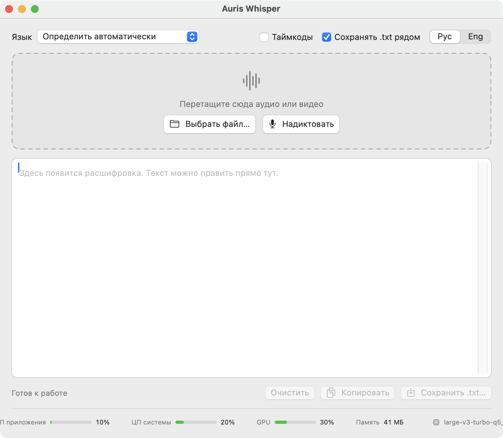

<div align="center">



# Auris Whisper

**Расшифровка речи без интернета — для macOS, Windows и Linux. Бросил файл или надиктовал — получил `.txt`.**
Без аккаунтов и загрузки куда-либо. Всё считается на вашем компьютере.

[](#скачать)
[](#скачать)
[](#скачать)
[](LICENSE)
[](https://boopi.ru)



</div>

---

## Что умеет

- **Перетащить аудио или видео** — mp3, m4a, wav, flac, aiff, caf, aac, ogg, opus,
  mp4, mov, mkv, webm. Можно бросить сразу несколько, обработает по очереди.
- **Голосовые из мессенджеров** (Ogg Opus) открываются. Формат определяется по
  содержимому файла, а не по расширению, — переименованные файлы тоже читаются.
- **Диктовка** (⌘R / Ctrl+R) с индикатором уровня, затем «Остановить и
  расшифровать». Запись сохраняется в `.wav` рядом с текстом.
- **Выбор модели — от крошечной до самой точной.** Модели не вшиты в установщик:
  после установки выбираете подходящую, и она один раз скачивается. Можно держать
  несколько и переключаться, удалять лишние, добавить свой файл модели.
- **Ускорение на видеокарте**: Metal на Apple Silicon, Vulkan на Windows и Linux
  (NVIDIA, AMD, Intel). Нет видеокарты — считает процессор, само.
- **Почти 30 языков распознавания** или автоопределение.
- **Интерфейс на русском или английском**, переключатель в правом верхнем углу.
- **Таймкоды** по галочке: `[00:12 → 00:19] фраза`.
- **Автосохранение**: `запись.mp3` даёт `запись.txt` в той же папке.
  Диктовки складываются в `Документы/Whisper`.
- **Текст правится прямо в окне** до сохранения.
- **Полоса нагрузки** внизу: процессор приложения и системы, видеокарта, память.
- **Длинные записи не разваливаются.** Whisper любит застревать и повторять одну
  фразу до конца файла. Здесь три защиты: детектор речи Silero, нарезка на куски
  примерно по 5 минут по самому тихому месту и повторный проход сорвавшегося куска.

Это не обёртка над веб-сервисом. После скачивания модели интернет не нужен вообще.

## Скачать

Возьмите установщик для своей системы в [релизах](../../releases):

| Система | Файл |
|---|---|
| macOS на Apple Silicon (M1–M4) | `AurisWhisper-x.y.z-macOS-AppleSilicon.dmg` |
| macOS на Intel | `AurisWhisper-x.y.z-macOS-Intel.dmg` |
| Windows 10 / 11 (64 бит) | `AurisWhisper-x.y.z-Windows-x64-Setup.exe` |
| Linux (любой дистрибутив) | `AurisWhisper-x.y.z-Linux-x86_64.AppImage` |
| Debian / Ubuntu / Mint | `AurisWhisper-x.y.z-Linux-x86_64.deb` |

Установщики весят 7–15 МБ: модель выбирается и скачивается при первом запуске.

### Первый запуск

**macOS.** Приложение подписано ad-hoc, без сертификата Apple Developer, поэтому
система предупредит, что не может проверить разработчика.
- macOS 15 и новее: попробуйте открыть, затем *Системные настройки →
  Конфиденциальность и безопасность* → внизу «Всё равно открыть».
- macOS 12–14: правой кнопкой по приложению → «Открыть» → «Открыть».
- Или одной командой в Терминале:
  `xattr -dr com.apple.quarantine "/Applications/Auris Whisper.app"`

**Windows.** У установщика нет платной подписи Microsoft, поэтому SmartScreen
покажет «Система Windows защитила ваш компьютер» → «Подробнее» → «Выполнить в
любом случае». Ставится в профиль пользователя, права администратора не нужны.

**Linux.** AppImage: `chmod +x AurisWhisper-*.AppImage` и запустить.
Пакет: `sudo apt install ./AurisWhisper-*.deb`.

Для диктовки система один раз спросит доступ к микрофону — разрешить.

## Модели

При первом запуске приложение предложит выбрать модель и подскажет, какая
подойдёт вашему компьютеру. Сменить или докачать другую — кнопка с именем модели
вверху окна.

| Модель | Размер | Качество | Скорость | Для чего |
|---|---|---|---|---|
| Tiny | 74 МБ | ●○○○○ | ●●●●● | черновики, слабые компьютеры |
| Base | 141 МБ | ●●○○○ | ●●●●● | чёткая речь |
| Small | 465 МБ | ●●●○○ | ●●●●○ | компьютеры без видеокарты |
| Medium | 1.4 ГБ | ●●●●○ | ●●○○○ | — (обычно лучше Turbo) |
| **Large v3 Turbo · compact** ★ | 547 МБ | ●●●●○ | ●●●●○ | **лучший выбор при видеокарте** |
| Large v3 Turbo | 1.5 ГБ | ●●●●● | ●●●○○ | чуть точнее compact |
| Large v3 | 2.9 ГБ | ●●●●● | ●○○○○ | максимум качества |

Ориентир: на Apple M4 модель Large v3 Turbo · compact расшифровывает 7,5 минут
речи за 32 секунды (×14 от реального времени).

Модели скачиваются с [HuggingFace](https://huggingface.co/ggerganov/whisper.cpp),
загрузка продолжается с места обрыва, файл сверяется по SHA-256. Лежат они здесь:

| Система | Папка моделей |
|---|---|
| macOS | `~/Library/Application Support/ru.boopi.auriswhisper/models` |
| Windows | `%APPDATA%\ru.boopi.auriswhisper\models` |
| Linux | `~/.local/share/ru.boopi.auriswhisper/models` |

**Компьютер без интернета?** Скачайте `.bin` на другом компьютере по ссылке выше и
добавьте кнопкой «Добавить файл модели…». Подходит любая модель whisper.cpp.

## Видеокарта и процессор

| Система | Чем считает |
|---|---|
| macOS, Apple Silicon | Metal (видеоядро M1–M4) |
| macOS, Intel | процессор + Accelerate |
| Windows, Linux | Vulkan — видеокарты NVIDIA, AMD и Intel; нужен свежий драйвер |
| нет видеокарты или драйвера | процессор, автоматически |

Если с видеокартой что-то не так, ускорение можно выключить в окне моделей —
тогда всё посчитает процессор. Внизу окна видно, на чём идёт расчёт.
На x86-64 нужен процессор с AVX2 (Intel Haswell 2013+ или AMD Ryzen/Excavator).

## Сборка из исходников

Нужны [Rust](https://rustup.rs), Node.js 18+, CMake и:
- **macOS** — Xcode Command Line Tools;
- **Windows** — Visual Studio 2022 Build Tools (C++), LLVM, [Vulkan SDK](https://vulkan.lunarg.com);
- **Linux** — `libwebkit2gtk-4.1-dev libayatana-appindicator3-dev librsvg2-dev libasound2-dev libclang-dev libvulkan-dev` и Vulkan SDK (нужен `glslc`).

```bash
git clone https://github.com/sibawal/auris-whisper.git
cd auris-whisper
npm install
npm run dev       # запустить в режиме разработки
npm run build     # собрать установщик для текущей системы
```

На Windows собирайте из *x64 Native Tools Command Prompt for VS* с
`set CMAKE_GENERATOR=Ninja` и короткой папкой сборки, например
`set CARGO_TARGET_DIR=C:\t` (генератор шейдеров Vulkan в whisper.cpp — вложенный
CMake-проект: с генератором Visual Studio он не находит компилятор, а в глубокой
папке его пути не влезают в 260 символов), и перед
`npm run build` один раз выполните `scripts\windows-runtime.ps1`: он положит рядом
с приложением рантайм Visual C++ и загрузчик Vulkan, чтобы приложение запускалось
на «чистой» системе.

Консольная проверка того же декодера и движка:

```bash
cd src-tauri
cargo run --release --example transcribe -- путь/к/модели.bin запись.m4a ru   # --cpu — без видеокарты
```

Важная деталь сборки: в [.cargo/config.toml](.cargo/config.toml) стоит
`GGML_NATIVE=OFF`. Без этого ggml вкомпилирует инструкции процессора, на котором
собирают (на M4 — SME/i8mm, на сервере CI — AVX-512), и у пользователей со
старыми процессорами приложение упадёт с «Illegal instruction».

Сборки для всех четырёх платформ делает GitHub Actions
([build.yml](.github/workflows/build.yml)): на каждой платформе прогоняется
смоук-тест распознавания, на тег `v*` собирается черновик релиза.

## Как устроено

Окно — [Tauri](https://tauri.app) (системный веб-движок + Rust), движок —
[whisper.cpp](https://github.com/ggml-org/whisper.cpp).

| Файл | Что делает |
|---|---|
| `src-tauri/src/audio.rs` | любой контейнер → 16 кГц моно: Symphonia + libopus, потоковый ресемплер |
| `src-tauri/src/engine.rs` | whisper.cpp через whisper-rs: нарезка, детектор речи, защита от зацикливания |
| `src-tauri/src/models.rs` | каталог моделей, загрузка с докачкой, проверка SHA-256 |
| `src-tauri/src/recorder.rs` | запись с микрофона (CoreAudio / WASAPI / ALSA) |
| `src-tauri/src/monitor.rs` | процессор и память; видеокарта через IOKit / PDH / sysfs |
| `src-tauri/src/lib.rs` | команды и события между окном и движком |
| `ui/` | интерфейс: HTML, CSS и JS без сборщиков |

Версия 1.x — нативное приложение на Swift только для macOS — осталась в истории
git (тег `v1.0.1`).

## Лицензия

MIT — см. [LICENSE](LICENSE), [перевод на русский](LICENSE.ru.md). Пользуйтесь, меняйте, распространяйте.

Внутри: [whisper.cpp](https://github.com/ggml-org/whisper.cpp) и ggml (MIT),
модели [Whisper](https://github.com/openai/whisper) от OpenAI (MIT), Silero VAD (MIT),
Tauri (MIT/Apache-2.0), Symphonia (MPL-2.0), libopus (BSD). Полный список — в
[THIRD-PARTY-LICENSES.txt](THIRD-PARTY-LICENSES.txt).

<div align="center">

Сделано в [boopi.ru](https://boopi.ru) · [English README](README.md)

</div>
